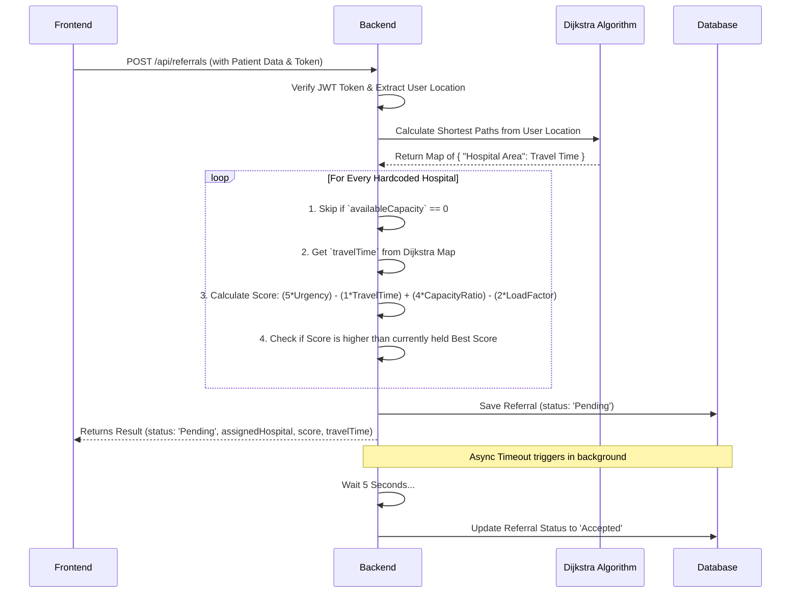

# Rural Referral Optimizer - Existing Workflow

This document outlines the exact workflow of the backend as it currently stands. You can share this with the frontend team so they understand exactly how the system processes data.

## 1. Authentication Flow

### Signup
1.  **Frontend** sends a `POST` request to `/api/auth/signup` with: `name`, `clinicName`, `location`, `contact`, and `password`.
2.  **Backend** checks if the `contact` already exists in MongoDB.
3.  **Backend** hashes the password using `bcryptjs`.
4.  **Backend** saves the new `User` to MongoDB.
5.  **Backend** responds with `{ "message": "User created successfully" }`.

### Login
1.  **Frontend** sends a `POST` request to `/api/auth/login` with: `contact` and `password`.
2.  **Backend** finds the `User` by `contact` and uses `bcryptjs` to verify the password.
3.  **Backend** generates a JSON Web Token (JWT) containing the `userId` and the user's `location`.
4.  **Backend** responds with `{ "token": "<jwt_string>" }`.

> [!IMPORTANT]
> The frontend **must** store this token (e.g., in `localStorage` or memory) and attach it to the `Authorization` header as `Bearer <token>` for all subsequent referral requests.

---

## 2. The Referral Creation Flow (The Core Logic)

This is the most complex part of the system. Here is step-by-step what happens when a doctor submits a new referral:



### The Scoring Algorithm Deep Dive
When the frontend sends urgency (`High`, `Medium`, or `Low`), the backend converts it to an integer (3, 2, or 1). 
The formula applied to *every* hospital is:

`Score = (5 * Urgency) - (1 * TravelTime) + (4 * CapacityRatio) - (2 * LoadFactor)`

*   **Urgency:** Higher urgency heavily inflates the score (`+5` multiplier).
*   **Travel Time:** Calculated dynamically by Dijkstra based on the doctor's registered `location`. Longer drives reduce the score.
*   **Capacity Ratio:** The percentage of beds available. More available beds increase the score.
*   **Load Factor:** How busy the hospital is. Busier hospitals reduce the score.

The hospital that yields the **highest final score** is selected.

---

## 3. The Retrieval Flow

### Getting Past Referrals
1.  **Frontend** sends a `GET` request to `/api/referrals` with the JWT token in the header.
2.  **Backend** verifies the token and extracts the `userId`.
3.  **Backend** queries MongoDB for all referrals belonging to that `userId`.
4.  **Backend** strips away database IDs and internal data.
5.  **Backend** responds with an array matching the exact contract:
    ```json
    [
      {
        "assignedHospital": "City General Hospital",
        "score": 12.5,
        "travelTime": 45,
        "status": "Accepted" // Or "Pending" if within 5 seconds of creation
      }
    ]
    ```
